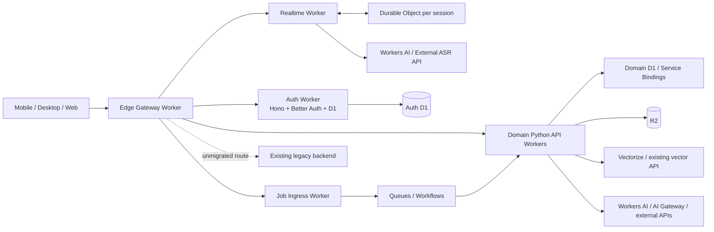

# Cloudflare 适配执行方案

状态：实施中；CF-00～CF-03/CF-04～CF-08 首期 staging 切片已部署并完成冒烟，Workers AI ASR、翻译、TTS additive 路由已实测，生产路由仍未切换
工作分支：`codex/cloudflare-adaptation`
代码基线：`92ee446e89`（`origin/main`）
调研日期：2026-08-27

## 1. 结论

Omi 可以由 Cloudflare Workers 承载稳定态服务，但不应把当前 `backend/main.py` 和完整 Python 依赖原样部署为一个 Python Worker。推荐采用 Worker-first 渐进式架构：

1. 用 TypeScript Edge Worker 统一接入 HTTP、WebSocket、鉴权和流量切换。
2. 用 Hono + Better Auth + D1 部署独立 Auth Worker。
3. 将 FastAPI 单体按少量业务域重组为原生 Python Workers；迁移期旧后端继续原地运行，只作为逐路由回滚目标，不再新建 Cloudflare Container 作为默认部署层。
4. ASR、TTS、LLM、Embedding、diarization 和必要的媒体转换优先通过 Workers AI 或外部 API 提供，不在 Cloudflare 内维护模型服务。
5. 实时语音连接迁移到 Realtime Worker + Durable Objects，直接对接 ASR API；客户端已支持的 codec 原样透传，确需转换时优先使用 provider 原生格式支持、轻量 Wasm 或外部媒体 API。
6. Python 代码保留 FastAPI/Pydantic 和纯业务逻辑，重写同步 SDK、线程、本地文件和全局初始化边界；任何原生 Worker 都不能导入整个单体。
7. R2、Queues、Workflows、KV、Durable Objects、Vectorize 按各自语义替代对象存储、任务、缓存、锁和向量投影，不能做一个伪装成 Redis/Firestore 的全局兼容层。
8. 新的 Cloudflare profile 优先使用 D1/R2/DO/Queues/Vectorize，减少外部基础设施；已有生产数据仍按账户和业务域迁移，只有容量、并发和查询压测通过后才切换权威。

稳定态目标是“应用服务全部由 Workers 承载，重能力通过 API 获取，持久状态使用 Cloudflare 托管产品”。Cloudflare Container 只保留为明确、可删除的应急选项：某条发布协议确实无法被 provider API、Wasm 或客户端格式覆盖时，才单独立项，不进入默认部署拓扑。

### 1.1 可行性判断

| 项目 | 判断 | 原因 |
|---|---|---|
| 当前 FastAPI 单体原样进入 Python Worker | 不可行 | 当前依赖包含 PyAV、ONNX Runtime、NumPy/SciPy、线程池、Redis 同步调用、Firebase/Google SDK 和本地文件语义；Python Workers 只支持 Pyodide/纯 Python 或可用轮子，线程和多进程不可执行 |
| 改造后的 FastAPI 子应用进入 Python Worker | 可行 | Cloudflare 提供 FastAPI/ASGI 入口，但应使用独立 Python 3.13+ 依赖闭包、异步 I/O 和 Workers bindings |
| 改造后以少量领域 Python Workers 承载业务 API | 可行且为主方案 | 需要独立 Python 3.13+ 依赖闭包、异步 Cloudflare bindings 和领域 composition root |
| 现有 Python 后端进入 Cloudflare Container | 技术可行但不作为主方案 | 会减少代码迁移量，却增加一套镜像、容量、冷启动和运行时运维；仅作经过批准的临时例外 |
| Better Auth 进入 Worker | 可行且推荐 | Better Auth 原生支持 Web Request/Response、Hono 和 D1；Cloudflare Worker 需启用 `nodejs_compat` |
| ASR 不在本机运行 | 可行且推荐 | 当前代码已经有 Deepgram 云端 provider 和其他 provider 策略；Cloudflare Workers AI 也提供实时 Deepgram 模型 |
| D1 作为新 Cloudflare profile 的领域数据库 | 可行 | Auth 与通过容量/并发资格检查的业务域使用 D1；不能用一个 D1 整体模拟 Firestore |
| R2 替代 MinIO/GCS 对象存储 | 可行 | 原生 Worker 使用 R2 binding；离线迁移工具可使用 S3 API，需要处理预签名 URL 域名限制 |
| Vectorize 直接替代全部 Pinecone/Qdrant | 部分可行 | Vectorize 最大 1536 维，而当前截图 embedding 路径存在 3072 维向量 |
| Next.js 16 部署 Workers | 可评估 | Cloudflare 当前推荐对 Next.js 16 使用 vinext，但仍为 beta，必须先运行兼容性检查 |

## 2. 当前代码基线与约束

### 2.1 后端形态

- `backend/main.py` 在进程启动时装载所有 router；当前对 `backend/routers/**/*.py` 的静态扫描得到 575 个已识别 route decorator，其中 570 个 HTTP 和 5 个 WebSocket。另有自带 app 的服务（例如 Parakeet）不计入主 router 数。实施时要由 OpenAPI 加手工 WebSocket 清单生成权威路由表，不能依赖这个调研数字长期不变。
- `backend/requirements.txt` 有约 235 个直接依赖，包含 `av`、`onnxruntime`、`numpy`、`scipy`、`opuslib`、`webrtcvad`、Redis、Pinecone、Qdrant、Typesense、Firebase Admin 和 Google Cloud SDK。
- `backend/utils/executors.py` 定义多个线程池，约 100 个非测试文件使用 executor。Python Worker 中线程 API 即使可以导入也不能作为执行模型使用。
- 约 67 个非测试文件直接调用 Redis，语义同时包含缓存、Lua、pipeline、锁、限流、队列和 Pub/Sub，不能一对一替换为 KV。
- 音频和说话人链路依赖 PyAV、ONNX、VAD、Opus、Sherpa 或本地模型文件；这些能力必须由 provider API、客户端格式升级或受控 Wasm 替代，无法替代的 route 暂时留在现有旧后端。
- 现有 `/v4/listen`、`/v4/web/listen`、`/v2/voice-message/transcribe-stream`、`/v1/omni/relay` 是长连接协议，迁移时必须保留鉴权位置、首帧格式、codec 参数、close code、重连、删除围栏和会话最终化行为。

### 2.2 已有 provider 能力

代码已经具备 API-first 的基础：

- `backend/config/stt_provider_policy.py` 是 STT provider 与 serving surface 的策略入口。
- `backend/utils/stt/streaming.py` 已支持 Deepgram cloud/self-hosted、Modulate、Parakeet、SenseVoice、Mimo 等 provider，并包含 circuit breaker 和 fallback 顺序。
- `backend/config/prerecorded_stt.py` 区分预录音 provider。
- `backend/scripts/stt/m_benchmark_streaming.py` 已有 Deepgram 与 Modulate 的 benchmark 基础。

Cloudflare 适配不应另写一套 STT 路由策略，而应把现有 provider policy 提炼成与运行时无关的决策层，再增加 Workers AI 或外部 API adapter。任何 provider 降级都必须调用共享 `record_fallback`，不能只打印日志。

### 2.3 认证现状

- 当前基线的 `auth-server/` 是 Express + Better Auth + PostgreSQL 形态，Better Auth lockfile 当前解析到 1.6.26。
- `backend/utils/auth_shim.py` 当前以同步 HTTP 获取 JWKS，并使用 `threading.Lock`；Worker 版本需要改为 Edge 统一校验，或使用请求级 async JWKS cache adapter。
- `feature/cloud-neutral-shim` 分支存在更完整的 Better Auth、JWKS 轮换、Firebase 密码校验、身份导入和自托管部署实现，但与当前基线有大量历史差异。Cloudflare 分支应选择性移植已验证的认证契约，不能整分支合并。
- 移动端、桌面端和 Web 仍有大量 Firebase 身份和数据依赖。Cloudflare 上部署一个 Better Auth 服务，并不等于生产身份迁移已经完成。

### 2.4 产品不变量

实施方案必须将以下契约设为发布闸门：

- `INV-DATA-1`：生产身份/数据权威迁移必须有身份与数据连续性证据、回滚计划和不可变版本标识；Cloudflare staging 必须使用独立身份空间。
- `INV-CUTOVER-1`：按账户执行 `legacy → migrating → new`，回滚使用 `rolled_back_stranded`；禁止无控制的双写。
- `INV-MEM-2`：向量命中只是候选，必须回源权威 memory；过期或缺失必须 fail closed 并记录 repair telemetry。
- `INV-MEM-3/4/5`：记忆写入、outbox、隐私与投影之间只允许一个权威来源。
- `INV-AUTH-1`：桌面端 session generation 和所有权语义不能因更换认证服务而改变。

## 3. Cloudflare 平台约束对架构的影响

| 平台事实 | 设计后果 |
|---|---|
| Worker isolate 内存 128 MB | 不能加载当前单体、ONNX 模型或大型科学计算依赖；每个原生 Worker 必须有独立 bundle 和内存门槛 |
| Paid Worker 压缩后 bundle 上限 10 MB，初始化前 64 MB | Python 子应用只允许最小依赖闭包；禁止导入 `backend/main.py` |
| Paid Worker 单次 CPU 最多 5 分钟，默认 30 秒 | HTTP 编排可放 Worker；模型推理、重音频处理和大批量任务走 API、Queues/Workflows |
| 单次请求最多 6 个同时外连 | 聚合 API 必须控制连接扇出、复用或分阶段执行 |
| Python Workers 当前为 Beta | 固定 `workers-py`、`pywrangler`、Wrangler 和 compatibility date；本地 workerd 通过后还必须执行真实 staging deploy/smoke |
| Python Workers 基于 Pyodide | 只使用官方可用包、纯 Python 包或 PyEmscripten wheel；出站 HTTP 使用 `workers.fetch`/JS FFI，避免标准 socket/DNS |
| Worker 文件系统是临时内存文件系统 | 持久对象进入 R2；任务进度进入 D1/DO；不能依赖 `/app/syncing` |
| D1 单库 10 GB、单线程执行 | 认证和合格业务域适合 D1；热点状态进 DO，大数据域需要拆分或显式 PostgreSQL 逃生口 |
| KV 最终一致，其他 PoP 传播可能超过 60 秒 | KV 只放可过期缓存/配置；锁、唯一连接、配额和强一致会话进入 Durable Objects |
| Queues 至少一次投递 | 每个任务必须有稳定幂等键、重试状态和 DLQ；消费者不能把“收到一次”当作“执行一次” |
| Vectorize 最大 1536 维 | 3072 维截图 embedding 暂留原向量库，或使用新 projection version 全量重嵌入 |
| R2 S3 预签名 URL 只能使用 S3 API 域名 | 品牌域名下载走 Edge Worker/R2 binding；私有直传可使用 S3 API 域名预签名 URL |

## 4. 目标架构



虚线旧后端只存在于迁移窗口：每完成一个 route group，就由 Edge 把该组权威切到 Worker；Cloudflare 稳定态拓扑不包含它。

### 4.1 运行时职责

| 组件 | 首期职责 | 不应承担 |
|---|---|---|
| Edge Gateway Worker | 自定义域、WAF 后路由、JWT 校验、CORS、请求 ID、灰度、内部断言 | 业务数据写入、长耗时模型调用 |
| Auth Worker | Better Auth API、D1 schema、JWKS、OAuth、内部用户生命周期 | 产品数据、Firebase 数据兼容层 |
| Realtime Worker + DO | WebSocket 协议、每会话强一致状态、重连、流量控制、ASR API 转发 | PyAV/ONNX 模型装载 |
| Native Python API Workers | 纯异步 HTTP 子域、Pydantic 校验、API 编排、R2/D1 binding | 导入单体、线程池、同步 SDK、长期任务 |
| Job Worker | 入队、幂等、批处理触发、DLQ，可由 Python Queue consumer 执行业务逻辑 | 在请求生命周期内完成全部后台任务 |
| Domain D1/DO | 领域权威数据、事务、强一致计数/会话 | 模拟全局 Firestore/Redis API |
| External APIs | ASR/TTS/LLM/embedding/diarization/必要媒体转换 | 成为没有质量、隐私和删除契约的黑盒 |

### 4.2 降低部署复杂度

Worker 数量多不等于需要手工逐个发布。Cloudflare 目录使用一个 workspace 和一个发布入口：

```text
./deploy/cloudflare/deploy staging
  1. 校验资源 manifest 与 secrets 名称
  2. 应用 auth/app D1 migrations
  3. 部署 auth、jobs、api-core、api-ai、realtime
  4. 运行内部 readiness 和契约 smoke
  5. 最后部署 edge，使新版本可达
  6. 写入所有 deployment IDs 和 migration versions
```

回滚顺序相反：先把 Edge 指回上一组 route owners，再回滚无状态 Worker；D1 schema 不做破坏性 down migration，使用向前兼容修复或 Time Travel/备份恢复。生产发布由同一命令生成不可变 release manifest，避免人员在 Dashboard 手工配置。

为了控制日常复杂度，稳定态初始只设 5 个部署单元：`edge`、`auth`、`api-core`、`api-ai`、`realtime`；`jobs` 可先作为 `api-ai` 同项目的 Queue consumer，只有权限或扩缩容证据要求时才拆开。D1 初始只设 `auth-db` 与 `app-db`，DO namespace 按强一致职责定义，不能按功能页面随意增加。

## 5. API-first 模型与媒体策略

### 5.1 原则

1. 能通过稳定 API 提供的模型能力，默认不构建本地推理镜像。
2. provider 选择按 serving surface 独立决策：streaming、prerecorded、PTT、TTS、embedding 不能共用一个粗粒度开关。
3. 迁移前用真实、已脱敏的多语言音频集做质量和延迟对比，不因“可以调用”直接替换生产 provider。
4. API 请求中不得记录音频、transcript、prompt 或 PII；只记录 provider、model、区域、耗时、状态、用量和匿名 request ID。
5. provider 切换、降级、fail-open 或质量模式变化必须走 `record_fallback`。

### 5.2 Provider 决策矩阵

| 能力 | Cloudflare 首选 | 备选 | Worker 内只保留 | 发布门槛 |
|---|---|---|---|---|
| Streaming ASR | Workers AI Deepgram realtime 或现有 Deepgram cloud | Modulate/现有云 provider | 协议归一、buffer、重连、fallback | 首字延迟、最终段延迟、WER、语言覆盖、断线恢复、成本/分钟 |
| Prerecorded ASR | Workers AI Whisper/外部 batch ASR | 当前 Parakeet/Modulate/MOSS API 路径 | job 状态、callback、结果归一 | WER、说话人/时间戳、最长音频、回调重试、成本/分钟 |
| PTT | 外部/Workers AI 低延迟模型 | 当前 provider policy 中已支持的云 provider | 取消、超时、短音频结果归一 | 端到端 p95、短音频空结果率、取消语义 |
| TTS | Workers AI/外部 TTS API | 当前 TTS provider | streaming proxy、缓存键和授权 | 首包、自然度、语言/voice 覆盖、缓存和版权约束 |
| LLM | AI Gateway 转发现有 OpenAI/Anthropic/Gemini，或 Workers AI | 现有 API 直连 | prompt/工具编排、结构化结果校验 | JSON/工具调用兼容、质量、token 成本、区域 |
| Embedding | Workers AI 或现有 OpenAI/Gemini API | 现有 provider | 文本准备、version 和 outbox | 维度、距离分布、召回率和 projection version 必须固定 |
| Diarization / speaker ID | 有质量等价物时使用 API | 当前远程任务/Modal 形态 | 输入/输出契约、删除和 fallback | 说话人一致性、隐私、模型版本和删除能力 |

### 5.3 STT 代码改造

1. 保留 `backend/config/stt_provider_policy.py` 作为 provider 允许范围与 fallback 顺序的单一事实源。
2. 将 `backend/utils/stt/streaming.py` 中 provider SDK、线程锁和 socket 管理拆成 adapter：
   - Legacy adapter：迁移窗口内保留现有 Deepgram SDK 等实现，只供旧服务使用。
   - Worker adapter：使用 WebSocket/fetch 访问 Workers AI 或 provider API。
   - 共享协议层：只包含模型选择、语言能力和 segment 标准化。
3. 给每个 adapter 暴露相同事件：`connected`、`partial`、`final`、`error`、`closed`、`provider_usage`。
4. provider API 的连接不能直接成为客户端协议；Realtime DO 负责重连、buffer 上限、backpressure 和事件去重。
5. 保持现有 provider circuit breaker 语义，并增加按 region/model/surface 的低基数指标。
6. 若某 codec 无法被目标 API 接收，决策顺序固定为：客户端版本化输出目标 codec → provider 原生输入格式 → 受控 Wasm 转换 → 外部媒体 API。只有前三者与外部 API 都无法满足协议/SLO 时，才能另立 Container 例外 PR。

## 6. 组件详细设计

### 6.1 Edge Gateway Worker

建议路径：`deploy/cloudflare/workers/edge/`

职责：

- 统一接收 `api`、`auth`、`ws` 和对象访问域名。
- 删除外部请求中的所有内部身份头，例如 `X-Omi-*`，防止伪造。
- 校验 Firebase 或 Better Auth JWT，并根据部署 profile 选择 issuer、audience 和 JWKS。
- 通过 Service Binding 向领域 Worker 传递已验证的 auth context；迁移窗口若回源旧后端，则发送短期、带 audience 的内部签名断言，包含 `uid`、session generation、request ID、原始 auth authority 和不超过 60 秒的过期时间。
- 通过 Service Binding 调用 Auth、Realtime、Job、Data 和原生 API Worker；下游 Worker 不暴露额外公网域名。
- 用路由清单控制 `legacy`、`native`、`realtime` 三类目标；灰度按环境、账户 cohort 或固定百分比进行。
- 保持 HTTP 状态、响应头、streaming/SSE 和 WebSocket upgrade 语义。

必须验证：

- 外部伪造内部头被剥离。
- JWT issuer/audience/expiry/key rotation 全部校验。
- 下游超时和断路不会把非幂等写请求自动重放。
- 每个响应记录 route owner、部署版本和匿名 request ID。

### 6.2 Auth Worker：Hono + Better Auth + D1

建议路径：`deploy/cloudflare/workers/auth/`

实现要求：

1. 使用 Hono 暴露 `/api/auth/*`，把 Hono `Request` 直接交给 Better Auth handler。
2. Wrangler 启用 `nodejs_compat`，Better Auth 使用 D1 binding：`database: env.AUTH_DB`。
3. auth 实例从当前请求的 env 构造，不在模块级缓存一个永久 promise。Better Auth 上游仍有 Workers isolate 首次请求中止后缓存初始化可能被污染的开放问题，必须通过真实 Worker abort/retry 压测验证后才能考虑缓存。
4. 从 `feature/cloud-neutral-shim` 选择性移植并写契约测试：
   - Firebase 密码 hash 校验与升级。
   - Google/Apple provider 的账户链接规则。
   - ES256 issuer/audience。
   - JWKS active/retired/grace 轮换。
   - `/internal/users/:uid` 的查询、删除和 residual 检查语义。
   - 身份导入 ledger、checksum 和可重放性。
5. Better Auth schema 使用程序化 migration 生成并提交 SQL；生产 migration 与 Worker 部署是两个独立步骤。
6. `BETTER_AUTH_SECRET`、OAuth secret、私钥和内部服务密钥全部使用 Worker secrets；`.dev.vars` 只允许本地未跟踪文件。
7. `trustedOrigins` 和 CORS 使用完全匹配的允许列表；带 credential 时禁止 `*`。
8. `advanced.backgroundTasks.handler` 连接 `ctx.waitUntil`，但耗时身份任务仍进入 Queue。
9. `/health` 只证明进程可响应；`/ready` 必须至少执行 D1 查询并确认 active signing key 存在。

身份迁移分为两个不同目标：

- Cloudflare/self-host profile：先使用独立 D1 和独立 OAuth client，不能与生产身份空间混用。
- Omi 生产 profile：必须单独引用 `INV-DATA-1`、`INV-CUTOVER-1` 和 `INV-AUTH-1`，完成全端 refresh/session 兼容后才能按账户切换。

迁移顺序：

1. 建立 auth D1、运行 schema migration、备份并记录 migration version。
2. 导入用户、账户、credential、session 和 JWKS metadata，写入 source checksum 与目标 identity ID。
3. 在 staging 比较登录、刷新、OAuth callback、账户链接、登出、删号和 token 验证。
4. 保留旧 issuer JWKS 的验证重叠窗口；先让资源服务接受新旧 token，再切换签发方。
5. 切换一个内部 cohort；任何身份不一致立即停止扩 cohort。
6. 回滚时停止新签发并恢复旧 authority；新系统写入的身份变化必须进入 stranded report，禁止静默丢弃。

### 6.3 Worker-native 应用平面

稳定态只维护少量部署单元，避免把每个 router 变成一个 Worker：

| Worker | 建议语言 | 业务范围 |
|---|---|---|
| `edge` | TypeScript | 公网入口、鉴权、灰度、Service Bindings |
| `auth` | TypeScript | Better Auth、OAuth、JWKS、auth D1 |
| `api-core` | Python/FastAPI | 用户、配置、订阅读取、conversation/memory 等常规 HTTP 业务，按 bundle 结果再细分 |
| `api-ai` | Python/FastAPI | LLM、embedding、预录音 ASR 等 API 编排，不执行本地模型 |
| `realtime` | TypeScript + DO | listen/PTT/relay WebSocket 与实时 ASR API |
| `jobs` | Python 或 TypeScript | Queue consumers、Workflows step、outbox/backfill |

部署数量不是硬编码。CF-00 先计算 import graph、bundle、内存和共同变更频率；只有某个领域超过限制、扩缩容特征完全不同或需要独立权限时才继续拆分。所有 Worker 使用一个 workspace、统一命令和一份环境资源 manifest，日常部署由一个脚本按依赖顺序完成。

迁移期间：

- 未迁移 route 仍由 Edge 回源现有 backend，不为它另建 Cloudflare Container。
- 已迁移 route 的数据 authority 必须明确，Edge 不做请求级随机双写。
- 每一组 route 通过契约测试和 staging 后切换；回滚只改变 Edge route owner。
- 当最后一个 route 被迁移并完成观察期，旧后端才能下线。

### 6.4 原生 Python API Workers

建议路径：`deploy/cloudflare/python/api/`，内部可按领域分包。

每个子应用必须：

- 使用独立 `pyproject.toml`，声明 Cloudflare 当前要求的 Python 3.13+，不能沿用整个 `backend/requirements.txt`。
- 使用 `from workers import asgi` 和 `Default = asgi.entrypoint(app)` 暴露 FastAPI ASGI 应用。
- 只导入 Pydantic model、纯业务函数、prompt、异步 HTTP 编排和 Worker-compatible adapter。
- 从 `request.scope["env"]` 或请求依赖获取 D1/R2/Service binding，禁止在 import 时读取远端配置或创建客户端。
- 使用 `workers.fetch`/JS FFI 或 Cloudflare binding；禁止 executor、thread、multiprocessing 和同步 cloud SDK。
- 将本地文件限制为有大小上限的请求级临时数据；持久对象写入 R2。
- 对 CPU、内存、bundle、cold start 和 6 个外连限制建立 CI/预发布门槛。

保留与重写边界：

| 可直接复用 | 需要 adapter | 必须重写/保留在其他运行时 |
|---|---|---|
| Pydantic schema、纯函数、prompt、响应 DTO、授权规则 | 存储 repository、JWT/JWKS、API client、任务发布、日志/telemetry | 线程池、同步 Redis/Firebase/Google SDK、PyAV/ONNX/VAD、本地持久文件、单体 startup hooks |

首个候选路由不能凭名称挑选。先生成 route manifest，并满足：无 WebSocket、无线程、无原生依赖、无同步数据库、无本地持久文件、p99 CPU 低、调用扇出不超过 6。健康检查、纯配置读取或单 provider API 编排通常是合适候选，但必须以 import probe 和依赖图为准。

Python 改造使用“复制 composition root、共享纯内核”的方式，不建立兼容层：

1. 为 `api-core`/`api-ai` 新建 Worker 专用 `main.py`，只注册已分类 router。
2. 把共享 schema 和纯业务逻辑移动到 Worker-compatible package，同时迁移所有 in-tree caller。
3. 为 D1、R2、Queues、AI、Service Binding 定义 async repository/protocol。
4. Worker runtime 注入 Cloudflare 实现，legacy runtime 在迁移窗口注入旧实现；同一业务规则只有一份。
5. 一旦某 route 切换并稳定，删除该 route 对旧 adapter 的依赖；不保留永久双实现。

关键代码替换表：

| 当前代码边界 | Worker-native 目标 | 完成判据 |
|---|---|---|
| `backend/main.py` | `api-core`/`api-ai` 各自 composition root | Worker import 不再触发单体 router、模型或远端 client 初始化 |
| `backend/dependencies.py` 中 auth dependency | Edge 校验后的 typed auth context | route 测试覆盖 forged/missing/expired context，资源服务不重复同步拉 JWKS |
| `backend/utils/auth_shim.py` | Edge/Auth Worker 的 JWKS 与内部断言契约 | Python Worker 路径无线程锁和同步 HTTP |
| `backend/utils/executors.py` | 直接 async await、Queues 或 Workflows | Worker 路径没有 executor/thread；长工作离开 request lifecycle |
| `backend/utils/other/storage*.py` | async R2 repository | 上传、range、checksum、删除和 residual 契约通过 |
| `backend/utils/cloud_tasks_redis.py` | Queue producer + D1 idempotency ledger | 重复投递和 consumer crash 不产生重复副作用 |
| `backend/firestore_pg/*` 与直接 Firestore 调用 | 按领域 D1 repository | route 不依赖通用 document shim；事务和账户 cutover 有行为测试 |
| 直接 Redis/Lua/pipeline | KV、DO 或 Queues 的具体 primitive | 每个 key family 只有一个 owner，强一致语义有并发测试 |
| `backend/database/vector_db.py` | Vectorize/保留 provider 的 versioned projection adapter | 维度与 model 固定，命中后 authoritative hydrate |
| `backend/utils/stt/streaming.py` | Realtime Worker provider adapter + 共享事件契约 | 客户端协议 fixture、fallback、计费和断线行为一致 |

Realtime 是 TypeScript、现有 provider policy 是 Python，因此不能复制两份配置。迁移时把 provider/surface/language/model 能力移到版本化的 `stt-providers.yaml`，生成 Python 与 TypeScript typed artifact；生成器和两端 contract test 保证顺序、禁用 provider 和 fallback reason 一致。

### 6.5 产品数据：D1 优先、PostgreSQL 作为迁移逃生口

为了降低稳定态部署复杂度，新的 Cloudflare profile 默认使用领域 D1：

- `auth-db` 只由 Auth Worker 拥有。
- `app-db` 承载通过资格检查的用户、conversation、memory metadata、subscription snapshot 和 job ledger；随着容量增长可按高内聚领域拆库，但不能按 route 随意拆库。
- 强一致且天然按 key 分区的连接、配额、锁和短状态进入 DO/DO SQLite，不挤进全局 D1 热点。
- 大对象、音频、图片和导出文件进入 R2，D1 只保存 key、checksum、size、content type 和 authority metadata。

已有生产数据迁移期间可保留原 Firestore/PostgreSQL authority。若某领域不能通过 D1 资格检查，可使用 TypeScript Data Worker + Hyperdrive 访问外部 PostgreSQL；这是显式逃生口，不是默认基础设施。Hyperdrive 只加速外部 PostgreSQL/MySQL，不托管数据库。

避免让 Python Worker 逐文档远程调用 Data Worker；一次 Service Binding 调用应完成一个领域事务或一个已分页查询。

D1 只在领域通过以下资格检查后使用：

- 当前数据加 12 个月增长预测不超过单库 10 GB 的 70%。
- 目标 workload 的并发写入、p95/p99 和最坏查询在 staging 数据量下通过。
- 每行/每 BLOB 小于 2 MB，bound parameter、SQL 时长和每 invocation query 数不触顶。
- repository 已按领域定义，迁移不需要全局 Firestore compatibility shim。
- 有导出、checksum、Time Travel/备份和按账户回滚证据。

禁止策略：

- 不把 `backend/firestore_pg` 之类的同步兼容层直接放入 Python Worker。
- 不做 Firestore + PostgreSQL/D1 无期限双写。
- 不让 Vectorize、Typesense 或缓存成为 memory 权威数据源。

### 6.6 Redis 语义拆分

先生成 `redis-primitives.yaml`，逐个调用点记录 owner、key 形状、TTL、一致性、Lua/pipeline/lock/pubsub 和迁移目标。

| 当前 Redis 语义 | Cloudflare 目标 | 说明 |
|---|---|---|
| 可容忍陈旧的缓存、feature/config snapshot | KV | 必须允许 60 秒以上跨 PoP 传播和 cache miss |
| 限流、配额、原子计数 | Durable Object/DO SQLite | 按 uid、API key 或租户选择 stable object ID |
| 唯一连接、分布式锁、会话状态 | Durable Object | 不能用 KV 实现 |
| WebSocket presence、Pub/Sub | Durable Object WebSocket | 使用 hibernation API 降低空闲成本 |
| 后台任务 | Queues | 至少一次投递，业务幂等 |
| 多步骤长流程 | Workflows | 对需要等待、补偿和持久步骤的工作流使用 |
| OAuth state/强一致短状态 | Better Auth D1 或 DO | 不能依赖 KV 的读后写一致性 |

迁移窗口内，旧后端仍可继续使用已有 Redis；新 Worker 不新增 Redis 依赖。每个 primitive 切到 KV/DO/Queues 后由 Edge 保证只有新的 route owner 写入，不能通过一个 Redis-compatible facade 假装迁移完成。

### 6.7 R2 对象存储

原生 Worker 使用 R2 binding，避免打包 `boto3`。迁移工具若在 CI/运维机执行，可使用 S3 API；该工具不是线上应用依赖。

对象迁移采用 `copy → checksum → freeze owner write → delta copy → switch authority → verify`，禁止新旧目标双写。每个 bucket/prefix 记录：

- authority、owner、保留期限、加密方式、content type、最大对象、删除语义。
- `uid`/account deletion 如何枚举并验证 residual。
- upload/download 是否走 Worker、multipart 或 S3-domain presigned URL。
- branded custom domain 是否需要 Edge Worker 代理。

现有应用层 `ENCRYPTION_SECRET` 和段加密契约必须保留；更换存储服务不能隐式改变加密格式。

### 6.8 Realtime Worker + Durable Objects

建议路径：`deploy/cloudflare/workers/realtime/`

- 每个逻辑 listen session 对应一个 DO，而不是简单按 uid 共用一个 DO。建议 key 由 `uid + client_conversation_id + device/role` 的稳定组合派生，允许同一账号多设备或多 lane。
- DO 保存连接状态、codec 参数、最后确认 sequence、ASR provider 会话、buffer 水位、计费累计和最终化 fence。
- WebSocket hibernation 时只保存恢复所需的小状态；音频块进入有上限的内存 buffer，不能无限堆积。
- ASR 直连 Workers AI/外部 API。codec 优先由客户端版本化输出 provider 接受的格式；否则使用 provider 原生支持、受控 Wasm 或外部媒体 API。
- account deletion/freeze 状态在建立连接、恢复连接和最终写入前三处检查。
- 保持现有客户端协议。若希望统一为 linear16/16 kHz，必须通过版本化协议和全端兼容 PR，不能在 Cloudflare 迁移中静默修改已发布的 PCM8/AAC 行为。

迁移顺序：

1. `/v2/voice-message/transcribe-stream` 或流量较小的 PTT surface。
2. `/v4/web/listen` 内部 cohort。
3. `/v4/listen` 移动端 cohort。
4. `/v1/omni/relay`。

若以上某条发布协议不能在 Worker 的 CPU/bundle/内存范围内完成格式适配，而且目标 provider 确实不接受原始格式，该 surface 保持在旧后端，直到客户端升级或外部媒体 API 可用；不能因此把整个应用重新放回 Container。

每一步使用现有 WebSocket fixture 重放：鉴权、首帧、partial/final、断线重连、重复 segment、背压、provider 402/429/5xx、客户端取消、服务端 close code 和删除账号竞态。

### 6.9 Queues 与 Workflows

- 短任务、事件投递和独立重试使用 Queues。
- 多步骤、可等待、需要补偿或持续较久的流程使用 Workflows。
- 每条消息包含 `event_id`、`job_id`、`uid_hash`、schema version、attempt source 和 source revision；不放原始 transcript/音频，传 R2 object key。
- 消费者用业务 job ID 做幂等；在权威数据库记录 `accepted/running/succeeded/failed` 和输出 checksum。
- 区分 retryable、permanent 和 poison message；达到上限进入 DLQ 并报警。
- account deletion、conversation finalization、audio merge、embedding/outbox 等高风险流程必须列入 `backend/testing/workflow_contracts.json` 或等价的 Cloudflare contract suite。

### 6.10 向量与搜索

- 为每个向量 namespace 建立 manifest：model、dimension、distance、metadata、authority、projection version、backfill checkpoint、delete contract。
- `dimension <= 1536` 且 metadata/topK 需求满足时可迁移到 Vectorize。
- 当前 3072 维 screenshot embedding 不能直接写入 Vectorize。选项只有：保留 Pinecone/Qdrant，或建立新的 <=1536 维 model/projection version 后全量重嵌入与召回评估。
- Vectorize 命中只返回 candidate ID；随后必须从权威 memory repository hydrate。missing/stale 结果 fail closed，并写 repair/outbox telemetry。
- Typesense/SearXNG 首期继续使用现有外部 API；只有查询、排序和语言 parity 通过后才考虑 D1 FTS 等替代。

### 6.11 Web 应用

`web/app` 当前是 Next.js 16 standalone 形态并仍使用 Firebase client/auth/messaging。处理顺序：

1. 在无代码改动下运行 `npx vinext check`，记录 unsupported API、Node builtin 和 middleware/SSR 风险。
2. 在单独 PR 执行非破坏性的 `vinext init`，保留 `next dev` 和现有测试。
3. 先部署 Cloudflare preview/staging，不切换生产域名。
4. Better Auth client 改造独立于 hosting 改造；不能把“Web 可部署”与“生产身份迁移”绑定成一个 PR。
5. 保留 `NEXT_PUBLIC_API_BASE_URL` 和 `NEXT_PUBLIC_WS_BASE_URL` 的环境 profile，Cloudflare preview 使用独立 auth authority。

### 6.12 安全与可观测性

安全：

- WAF、bot/率限是外围保护，不替代应用 JWT/授权。
- Worker-to-Worker 调用使用 Service Binding；迁移窗口内的旧 backend 只接受并验证 Edge 的短期内部断言。
- JWT 明确 issuer、audience、algorithm、expiry 和 key ID；JWKS 轮换保留 grace。
- 日志使用 `utils.log_sanitizer` 或等价共享实现，禁止原始音频、transcript、memory、token、OAuth code 和 email。
- R2、D1、Queues、DO、外部 API key 分环境和最小权限；secret rotation 要有双 key 窗口。

指标与日志：

- 所有组件传播同一 request/job/session ID 和 source revision。
- 核心 dashboard：Edge 5xx/route owner、Auth 登录/刷新/JWKS、各 Worker cold start/CPU/内存、WebSocket active/reconnect/backpressure、ASR 首字/最终延迟与 fallback、Queue backlog/retry/DLQ、D1 查询、R2 错误、向量 hydrate miss/repair。
- 高基数标识只记录哈希或分桶；禁止把 uid、conversation ID 直接做 metrics label。
- Cloudflare 自带日志保留不足以作为唯一审计存储；生产需要 Logpush 或 OpenTelemetry 目标及保留策略。

## 7. 代码与部署目录

建议最终结构：

```text
deploy/cloudflare/
├── README.md
├── manifests/
│   ├── routes.yaml
│   ├── redis-primitives.yaml
│   ├── vector-namespaces.yaml
│   └── resources.yaml
├── workers/
│   ├── edge/
│   ├── auth/
│   ├── realtime/
│   ├── jobs/
│   └── data/
├── python/
│   ├── api-core/
│   ├── api-ai/
│   └── jobs/
├── migrations/
│   ├── auth-d1/
│   └── objects-r2/
└── scripts/
```

每个超过 12 个 source file 的 package 根目录都要添加 `README.md` 或 `ARCHITECTURE.md`，符合仓库 guardrail。Wrangler environment 至少分 `local`、`staging`、`production`；资源名、数据库 ID、bucket、queue、DO namespace 和 OAuth client 必须完全隔离。

## 8. 路由迁移清单

`routes.yaml` 是迁移期间的单一事实源，最少字段：

```yaml
- method: POST
  path: /example
  owner: backend-domain
  runtime: legacy
  target_runtime: python-worker
  auth_authority: firebase
  dependencies: [postgres, r2, external-api]
  protocol: http
  idempotency: required
  product_invariants: [INV-DATA-1]
  test_contract: backend/testing/...
  rollout: staging-only
  rollback: edge-route-to-legacy
```

允许的 `target_runtime`：

- `legacy`：迁移窗口内仍由现有后端拥有。
- `python-worker-candidate`：纯异步轻量 HTTP。
- `realtime-do`：WebSocket/强一致 session。
- `external-api`：ASR/TTS/LLM/embedding 等 provider 能力。
- `blocked`：缺少协议测试、数据 authority、provider API/Wasm 替代或客户端兼容。

Edge routing code 必须从已审查 manifest 生成或验证，避免文档和线上路由漂移。

## 9. 逐 PR 执行路线

以下 PR 有依赖关系，但每个 PR 都应能独立验证和回滚。除非用户明确要求，不推送、不开 PR、不合并。

### CF-00：平台清单与可重复 scaffold

输出：

- `deploy/cloudflare/README.md`、环境命名规则和固定 Wrangler/Node/Python 工具版本。
- 自动生成 `routes.yaml`，HTTP 来自 FastAPI OpenAPI，WebSocket 手工补充并由静态检查防漏。
- `redis-primitives.yaml`、`vector-namespaces.yaml`、R2 object namespace 清单。
- staging 资源创建脚本或 Wrangler config；不创建 production 资源。

验收：route 数量和 `backend/main.py` 注册 surface 一致；任何新增 route 未分类时 CI 失败。
回滚：纯 scaffold，无流量变化。

### CF-01：Edge Worker 空骨架

输出：Edge Worker、Service Binding interface、`/health`、request ID、内部头剥离、route owner 响应标记。
测试：Vitest/workerd 验证内部头、防重放、CORS、非幂等请求不重试、WebSocket upgrade。
发布：只到 staging hostname，无生产 DNS。
回滚：删除 staging route。

### CF-02：Python Worker 运行时与共享纯内核

输出：Python 3.13+ workspace、`api-core`/`api-ai` 空 FastAPI ASGI composition root、binding protocols、统一错误/日志/telemetry、import graph 和 bundle budget 检查。
代码改造：先抽取 Pydantic schema、授权规则和纯函数；不迁任何生产 route，不引入旧同步 adapter。
测试：Python Worker 本地测试、真实 staging smoke、bundle <10 MB gzip、内存 <128 MB、模块 import 无网络/线程/文件副作用。
发布：只暴露内部 `/health` 和测试 route，公网仍由旧 backend 提供业务。
回滚：删除 staging Service Binding，无业务状态。

### CF-03：Auth Worker 与独立 D1

输出：Hono + Better Auth、D1 migrations、JWKS 轮换、OAuth、内部用户生命周期、import/checksum tooling。
测试：Miniflare/真实 Worker 登录、刷新、OAuth、link、logout、delete/residual；首次请求被 abort 后立即并发重试；JWKS active/grace/retired。
发布：先使用独立 Cloudflare/self-host identity，不接生产客户端。
回滚：Edge auth route 回旧 authority；保留 D1 只读审计快照。

### CF-04：R2 对象平面

输出：Worker R2 binding adapter、离线 S3 copy/checksum/cutover 工具、删除 residual 验证。
测试：PUT/GET/range/multipart/content-type/checksum、预签名过期、账号删除、对象迁移中断后重放。
发布：按 bucket/prefix 切换，禁止双写。
回滚：在旧 authority 尚未清除前切回；新侧对象进入 stranded manifest。

### CF-05：App D1 与第一个 Python route group

输出：`app-db` 首个领域 schema、async D1 repository、由 manifest/import probe 选出的低风险 route group。
选择条件：无 WebSocket、无原生依赖、无同步 SDK、无本地持久文件、无复杂跨域事务、调用扇出 <=6。
测试：同一契约分别跑旧 backend 和 Worker；生产规模数据 fixture；事务/并发/删除；bundle、CPU、内存和 cold start。
发布：独立 Cloudflare profile 直接使用 D1；生产 profile 仅小 cohort，并执行账户级 authority cutover。
回滚：Edge 一键回旧 backend；有新写入时使用 `rolled_back_stranded`，禁止静默回灌。

### CF-06：Queues/Workflows 作业平面

输出：Job Worker、per-domain Queue/DLQ、D1 幂等 ledger、Python/TypeScript native consumer。
优先迁移：可重放的 embedding/outbox、异步后处理；删除账号和 conversation finalization 在 contract 完成后再迁。
测试：重复投递、乱序、429/5xx、poison message、consumer crash、DLQ replay。
回滚：停止新生产者，排空/导出 Queue，旧 backend 接管尚未切换 authority 的 job。

### CF-07：Redis primitive 拆分

输出：DO 限流/锁/连接状态、KV 缓存、Queue 替代任务；每个 key family 有 owner 和迁移状态。
测试：并发冲突、读后写、跨 PoP stale、TTL、重复连接、锁 owner crash。
发布：一次只迁一个 key family；新 Worker 不连接 Redis，未迁 route 继续由旧 backend 使用旧 Redis。
回滚：Edge/adapter 按 primitive 切回 Redis，不双写。

### CF-08：Realtime + API ASR

输出：Realtime Worker、session DO、Workers AI/外部 ASR adapter；必要 codec 使用客户端升级、provider 原生格式、Wasm 或外部媒体 API。
测试：协议 fixture、真实多语言音频 benchmark、首字/最终延迟、WER、背压、断线恢复、provider 402/429/5xx、删除围栏。
发布：PTT → web listen → mobile listen → omni relay；每一 surface 单独 cohort。
回滚：Edge WebSocket route 切回旧 backend；禁止同一 session 在两边同时拥有写 authority。

### CF-09：Vectorize 与搜索投影

输出：namespace manifest、<=1536 维 projection、backfill/outbox/checkpoint、hydrate/repair。
测试：召回质量、metadata filter、delete、重复 outbox、stale candidate、authoritative miss。
发布：先 shadow query 比较但不影响用户结果；切换后 Vectorize 仍只是 projection。
回滚：查询路由切回原向量库；权威 memory 无变化。

### CF-10：其余 Python API 领域

输出：按共同依赖和权限边界将剩余 HTTP route 迁入 `api-core`/`api-ai`，超过资源门槛时才新增领域 Worker。
改造：Firebase/Redis/Cloud Tasks/对象/模型 SDK 依次替换为 D1/DO/KV/Queues/R2/API adapter；所有线程池和同步网络调用退出 Worker 路径。
测试：每个 route group 的契约、核心路径、主要错误路径、bundle/CPU/内存/外连预算；高风险 workflow contract。
发布：一次一个领域；每个 route 保留明确 legacy rollback target。
回滚：Edge 路由切回旧 backend；按 authority 状态处理 stranded writes。

### CF-11：Web/vinext hosting

输出：`vinext check` 报告、Cloudflare preview、SSR/API compatibility、独立 deployment config。
测试：登录前页面、SSR、API proxy、WebSocket、静态资源、错误页和浏览器 E2E。
发布：preview/staging 域名；生产身份和生产域名单独批准。
回滚：DNS/route 回现有 Web hosting。

### CF-12：剩余生产数据 D1 迁移或 PostgreSQL 例外

新 Cloudflare profile 已从首个 route group 使用 D1；本 PR 处理已有生产大数据域。只有通过 D1 资格检查的领域才迁移，未通过者需要明确的 Data Worker + Hyperdrive 例外设计。
输出：领域 schema/repository、snapshot/checksum、账户 cutover、Time Travel/备份、stranded report。
测试：生产规模数据回放、写并发、最坏查询、账号删除、迁移中断和回滚。
发布：`legacy → migrating → new`，小账户 cohort；禁止双写。
回滚：`rolled_back_stranded`，列出新侧独有写入，不静默合并。

### CF-13：生产流量切换与旧面清理

前置：所有高风险 workflow contract、客户端 compatibility、身份连续性、对象删除、灾备演练通过。
输出：生产 runbook、on-call dashboard、告警、回滚开关、成本 budget、资源 ownership。
发布：1% → 5% → 25% → 50% → 100%，每级至少覆盖峰值窗口并满足 SLO。
清理：旧服务只在所有 route owner 已迁移、回滚窗口和 live evidence 完成后删除；数据/身份旧 authority 清理需要单独高风险批准。稳定态资源清单应只包含 Workers、D1、DO、R2、Queues/Workflows、Vectorize 和明确批准的外部模型 API/数据库例外。

## 10. 测试与验收矩阵

### 10.1 本地/CI 命令基线

具体命令应由 CF-00 固定版本后落入 package scripts；预期最少包含：

```bash
# 仓库规则与既有后端
backend/test.sh
make preflight

# TypeScript Workers
npm ci
npm test
npx wrangler types
npx wrangler deploy --dry-run

# Python Worker
uv sync --frozen
uv run pytest
uv run pywrangler dev
uv run pywrangler deploy

# Next.js 16 compatibility
npx vinext check
```

不能只以 dry-run 证明运行正常。每个 runtime 至少在真实 Cloudflare staging 执行一次用户可见路径。

### 10.2 发布硬门槛

| Surface | 必须证据 |
|---|---|
| Edge | header spoof、防重放、JWT、CORS、route rollback、非幂等超时行为 |
| Auth | 登录/刷新/OAuth/link/delete、导入 checksum、JWKS rotation、abort/retry、客户端 session generation |
| Python Workers | route parity、bundle、内存、CPU、cold start、外连数、import side effect、错误映射 |
| ASR | 按语言/设备/噪声的 WER、首字和 final p50/p95/p99、断线、成本/分钟、数据处理区域 |
| Realtime | 协议 fixture、背压、重连、重复/乱序、close code、删除 fence |
| Queue | 至少一次、幂等、DLQ、重放、部分失败、积压恢复时间 |
| R2 | checksum、range、multipart、过期、删除 residual、迁移中断 |
| D1 | 规模、并发、最坏 SQL、备份/恢复、账户级 cutover/rollback |
| Vector | 召回、projection version、hydrate、stale fail closed、删除 |
| Web | vinext compatibility、SSR、auth、API、WS、preview E2E |

### 10.3 建议初始 SLO 门槛

这些是启动 benchmark 的建议值，CF-00 需要用当前生产基线替换，不能直接当成产品承诺：

- Edge 自身增加的 p95 延迟不超过 20 ms（不含下游）。
- Auth warm p95 不差于现有服务 20%；错误率不高于现有基线。
- Python Worker warm API p95 不差于现有服务 20%；cold path 有单独指标和预算。
- Streaming ASR 首字/最终延迟、WER 在每种核心语言不劣于当前 provider 的已批准阈值。
- Queue 重复执行导致的用户可见副作用为 0。
- 数据、对象和身份迁移 checksum 差异为 0；允许差异必须逐条有 owner 和解释。

## 11. 回滚设计

### 11.1 路由回滚

- Edge route manifest 为唯一切换面；每个迁移 route 在观察窗口内必须保留原旧 backend target。
- 回滚版本使用不可变 deployment ID，不能依赖“重新构建上一个版本”。
- 非数据变更可按 route/cohort 即时回退。

### 11.2 状态与数据回滚

- 禁止新旧系统双写来制造虚假安全感。
- 数据切换前冻结该账户写入、排空相关 job、复制增量、校验后改变 authority。
- 新 authority 产生写入后若回滚，账户进入 `rolled_back_stranded`；保留新侧数据和 manifest，不能悄悄覆盖旧侧。
- Auth、对象、memory、subscription 和 account deletion 分别有 residual checker。

### 11.3 Provider 回滚

- ASR/TTS/LLM provider 的动态切换只能在已测试的允许矩阵内执行。
- provider fallback 需要 `record_fallback`，包含 from/to/reason/surface，不含用户内容。
- codec 或协议不兼容不能通过 provider fallback 掩盖，必须关闭 cohort 并回原 runtime。

## 12. 成本模型

Workers Paid 当前最低约 5 美元/月，但它不是完整后端总成本。粗略预算应至少分：

- Workers 请求和 CPU。
- Durable Objects 请求、存储和执行时长。
- D1 rows read/write 和存储。
- R2 存储、Class A/B 操作和可能的传输路径。
- Queues 操作。
- Vectorize queried/stored dimensions。
- Workers AI neurons 或外部 ASR/TTS/LLM API 用量。
- 迁移期间的旧 backend，以及经例外批准的外部 PostgreSQL/向量/搜索服务。
- 日志、Logpush/OTel 目标和告警。

Worker-first 稳定态没有常驻 Container 固定成本。最终预算使用实测的 `request_count × CPU_ms`、DO duration、D1 rows、R2/Queue 操作、音频分钟数、模型 token/neurons 和日志量计算，并设置 Cloudflare 与外部 provider 双重 budget alert。Workers Paid 的 5 美元只是共享用量起点，不应当作完整月费预测。

## 13. 中国大陆访问

普通 Workers Paid 套餐不等同于 Cloudflare 中国网络。若要求中国大陆境内优化与合规接入，需要单独评估 Cloudflare China Network、Enterprise 合同、ICP备案/许可证、可用产品子集和数据处理区域。此项是商业与合规 gate，不能在普通 5 美元套餐的技术 PoC 中默认满足。

## 14. 开工前必须确定的决策

这些问题不阻塞 CF-00/CF-01 的 staging scaffold，但会阻塞对应生产阶段：

1. 目标是独立 self-host/Cloudflare profile，还是替换 Omi 生产 Firebase 身份与数据权威。
2. 哪些数据域能进入 D1；任何外部 PostgreSQL 例外的 provider、区域、连接限制和灾备目标。
3. 各语言/场景 ASR 的质量基线、允许数据区域和每分钟成本上限。
4. 哪些 codec 必须由客户端升级、Wasm 或外部媒体 API 处理；不能把未解决的 codec 隐藏在本地服务中。
5. 哪些产品数据领域具备 D1 迁移价值；不能只因“套餐包含 D1”跳过容量和并发验证。
6. 3072 维 screenshot embedding 是保留现有向量库，还是以新 model version 重嵌入。
7. Web Next.js 16 是否接受 vinext beta，或继续现有 hosting 直到稳定。

## 15. 官方资料

本方案使用的主要官方资料：

- [Cloudflare Python Workers + FastAPI](https://developers.cloudflare.com/workers/languages/python/packages/fastapi/)
- [Cloudflare Python Workers overview](https://developers.cloudflare.com/workers/languages/python/)
- [Python Workers packages](https://developers.cloudflare.com/workers/languages/python/packages/)
- [Python Workers standard library](https://developers.cloudflare.com/workers/languages/python/stdlib/)
- [Python/JavaScript FFI](https://developers.cloudflare.com/workers/languages/python/ffi/)
- [Workers limits](https://developers.cloudflare.com/workers/platform/limits/)
- [Workers pricing](https://developers.cloudflare.com/workers/platform/pricing/)
- [D1 limits](https://developers.cloudflare.com/d1/platform/limits/)
- [D1 Worker API and batch transactions](https://developers.cloudflare.com/d1/worker-api/d1-database/)
- [Hyperdrive](https://developers.cloudflare.com/hyperdrive/)
- [R2 presigned URLs](https://developers.cloudflare.com/r2/api/s3/presigned-urls/)
- [Queues delivery guarantees](https://developers.cloudflare.com/queues/reference/delivery-guarantees/)
- [KV consistency model](https://developers.cloudflare.com/kv/concepts/how-kv-works/)
- [Durable Objects WebSocket best practices](https://developers.cloudflare.com/durable-objects/best-practices/websockets/)
- [Vectorize limits](https://developers.cloudflare.com/vectorize/platform/limits/)
- [Service Bindings](https://developers.cloudflare.com/workers/runtime-apis/bindings/service-bindings/)
- [Workers secrets](https://developers.cloudflare.com/workers/configuration/secrets/)
- [Workers AI OpenAI-compatible API](https://developers.cloudflare.com/workers-ai/configuration/open-ai-compatibility/)
- [Workers AI pricing](https://developers.cloudflare.com/workers-ai/platform/pricing/)
- [AI Gateway realtime WebSocket API](https://developers.cloudflare.com/ai-gateway/usage/websockets-api/realtime-api/)
- [Cloudflare Workflows](https://developers.cloudflare.com/workflows/)
- [Next.js on Workers](https://developers.cloudflare.com/workers/framework-guides/web-apps/nextjs/)
- [Cloudflare China Network](https://developers.cloudflare.com/china-network/)
- [Better Auth Hono integration](https://better-auth.com/docs/beta/integrations/hono)
- [Better Auth 1.5 native D1 support](https://better-auth.com/blog/1-5)
- [Better Auth database and migrations](https://better-auth.com/docs/concepts/database)
- [Better Auth options](https://better-auth.com/docs/reference/options)
- [Better Auth Workers initialization issue #10315](https://github.com/better-auth/better-auth/issues/10315)

## 16. 推荐第一迭代

第一迭代实施 CF-00 到 CF-03，并提前做 CF-08 的 ASR spike：

1. 生成路由/Redis/向量/对象清单。
2. 部署无业务的 Edge Worker。
3. 建立 `api-core`/`api-ai` Python Worker 的独立 Python 3.13+ ASGI composition root、bindings 和资源预算检查，不迁生产 route。
4. 部署独立 Auth Worker + D1，验证 Better Auth、JWKS 和身份导入，但不切生产身份。
5. 选择一个 streaming ASR surface，在 Realtime Worker PoC 中分别 benchmark Workers AI Deepgram 和当前 Deepgram cloud API；此时不切生产流量。

这一迭代能同时回答最关键的工程问题：FastAPI/Pydantic 纯内核在 Python Worker 的 bundle、内存和冷启动，Edge/Service Binding 的协议，Better Auth 在 Worker/D1 的稳定性，以及 API ASR 的质量与成本。通过这些证据后，CF-04/CF-05 迁移第一个真正的 Worker-native 业务闭环；不需要先部署 Container。

### 16.1 已落地的首期证据（2026-08-27）

代码位于独立 worktree 分支 `codex/cloudflare-adaptation` 的
`deploy/cloudflare/`，资源名全部带 `omi-cf-` 前缀，未修改已有 Worker、生产
DNS 或生产数据库。当前 staging 已部署：

- `omi-cf-edge-staging`：公开入口、请求 ID、CORS、Bearer → Auth service binding、内部 auth context 签名、Realtime/API 路由。
- `omi-cf-auth-staging`：Hono + Better Auth 1.6.26 + D1，包含 Better Auth 基础表和 JWKS 表迁移；Auth 构造按请求创建，避免 abort 后的全局初始化污染。
- `omi-cf-api-core-staging`：FastAPI Python Worker + D1 `cf_worker_probe`、uid-scoped R2 asset API、uid-scoped 转写偏好/语言/onboarding/隐私/通知/城市上下文同意、短时 geolocation TTL row、daily-summary/mentor notification 偏好、training-data opt-in 状态与 private-sync 联动、FCM token 注册、开发者 webhook 配置/开关状态、assistant-settings 深合并和低风险 ai-profile 投影、客户端 API key 配置读取、公开 firmware stable/latest/version APIs、公告/版本更新公开读取与用户 dismiss，以及 staging-only 的 D1-backed action-item CRUD/reconciliation（含 Apple Reminders pending/sync-batch projection）、daily/weekly/overall score projection、focus-session CRUD/stats、text-only screen-activity sync/list/summary、calendar onboarding flags、People 元数据 CRUD、goal 元数据/metric/daily-history/progress-events/canonical-list/canonical-create/focus/lifecycle CRUD、work-intent/workstream journal/artifact/checkpoint CRUD 和 folder 元数据/排序 CRUD，未导入 `backend/main.py`。
- `omi-cf-api-ai-staging`：FastAPI Python Worker + Cloudflare 原生 `workers.fetch` 外部 embedding/预录音 ASR/桌面 TTS/Auto model-pick 和固定目标 AI API proxy seam，并通过原生 `AI` binding 提供受限 raw-audio Workers AI ASR、BGE text embeddings、m2m100 翻译和 Deepgram Aura-1 TTS seam；provider 未配置时按原契约安全回退或返回 `503`。
- `omi-cf-realtime-staging`：Realtime Worker + Durable Object，每会话按 `uid/session-id` 分片；内部 context 使用 HMAC 校验后才允许 WebSocket upgrade，ASR 通过外部 WebSocket API 接入。
- `omi-cf-jobs-staging`：Jobs Worker + Queue + D1 job ledger，支持稳定 `jobId` 的 `probe` 与 raw-audio `transcribe` kind；后者用临时 R2 对象、幂等键和最多三次 Workers AI 重试完成异步 Whisper 投影，并提供 uid-scoped job status/result read。
- `manifests/routes.yaml` 与 `manifests/resources.yaml`：152 条首期路由和 10 个 staging 资源；`npm test` 前置校验会检查字段、命名空间、重复项、禁止 broad `/v1/*` ownership 及 Edge 路由表示。Edge 只把显式迁移的 route 送入 partial Worker，未迁移的认证 route 在配置 `LEGACY_BACKEND_URL` 时回旧后端。

已执行并通过：

```text
npm run typecheck                         # pass
npm test                                  # 8 files / 36 tests pass
uvx uv==0.12.3 run pytest -q             # api-core: 51 tests pass
uvx uv==0.12.3 run pywrangler dev --help  # pass for api-core/api-ai
wrangler deploy (staging)                 # six Workers uploaded
curl /health                              # auth/core/ai/realtime/edge → HTTP 200
curl /ready                               # auth D1 → ready
Better Auth sign-up + Edge /v1/cf/probe   # D1 row written, HTTP 200
unauthenticated API/Realtime requests     # fail closed, HTTP 401
invalid Realtime HMAC                     # fail closed, HTTP 401
authenticated /v1/stt/transcribe          # provider 未配置时 HTTP 503
authenticated realtime contracts          # non-WS requests HTTP 426
R2 PUT → GET → DELETE                      # body round-trip, then HTTP 404
Jobs enqueue duplicate → one ledger row    # queue/D1 idempotency contract
Queue consumer                          # status=completed, attempts=1
Queue job status read                    # GET by jobId, uid-scoped, payload omitted
public firmware stable/latest/version   # GitHub Releases API → HTTP 200/metadata
transcription preferences GET/PATCH    # D1 typed row, uid scoped → 200/400/401
user language GET/PATCH/catalog          # normalized language + atomic mode update → 200/400/401
user onboarding GET/PATCH                # partial D1 state update, uid scoped → 200/400/401
privacy settings GET/POST                # recording/private-sync flags, destructive DELETE stays legacy → verified
notification settings GET/PATCH          # D1 defaults and bounded frequency → 200/400/401
daily summary/mentor settings GET/PATCH  # D1 defaults, bounds, uid scope → 200/400/401
training data opt-in GET/POST             # D1 pending-review state + private-sync linkage → 200/400/401
FCM token POST                            # D1 uid/device-scoped token registration → 200/400/401
developer webhook config/status           # D1 uid/type-scoped config + toggle state → 200/400/401
location context consent GET/PUT         # D1 consent TTL/revocation + disclosure gate → 200/401/422
geolocation PATCH                         # D1 30-minute TTL, invalid input ignored → 200/401
users/profile GET                         # Better Auth D1 identity projection, unknown user → 200/410/401
assistant settings GET/PATCH              # D1 JSON deep merge, uid scoped → 200/400/401
AI profile GET/PATCH                      # D1 low-risk projection, bounded text → 200/400/401
desktop TTS POST                         # OpenAI-compatible provider proxy → 200/400/401/503
auto model pick GET                     # D1 24h cache + provider/default provenance → 200/401
native Workers AI translation POST      # m2m100 en→zh through Edge → HTTP 200; unsupported language → 400
native Workers AI TTS POST              # Aura-1 raw MP3 through Edge → HTTP 200/audio-mpeg
native Workers AI embeddings POST      # BGE text batch, 768-dimension vectors → HTTP 200
action-item CRUD                       # D1 uid-scoped create/list/update/complete/delete + batch/reconciliation + Reminders sync projections → verified
announcements                           # D1 changelog/feature/general + pending targeting + per-user dismiss → unit verified
people metadata CRUD                   # D1 uid/name-scoped create/list/rename/delete; speech samples stay legacy → verified
goal metadata CRUD                     # D1 uid-scoped current/all/create/read/update/progress/soft-delete → verified
goal detail projection                 # bounded uid-scoped goal/workstream/task/progress-event composition → verified
conversation metadata mutations        # canonical title/starred updates through D1; visibility/share index stays legacy → unit + staging verified
goal staging smoke                     # Edge → API Core → D1 goal create/list/update/progress/soft-delete; marker cleaned → verified
folder metadata CRUD                   # D1 system/custom folder create/list/update/delete/reorder; conversation list/single move use D1 projection → verified
conversation action-item reads         # canonical list/count from uid-scoped standalone task projection; locked rows fail closed → unit + staging verified
- conversation photo reads             # canonical uid-scoped D1 photo projection; locked rows fail closed; legacy photo writes/subcollections remain → unit + staging candidate
- conversation segment text edit       # canonical bounded D1 transcript edit with updated-at CAS; locked rows fail closed; legacy encryption/provider mirrors remain → unit + edge verified
- account cutover control              # canonical D1 legacy/migrating/new/stranded control projection; missing=legacy, malformed=503; no automatic transitions → unit + edge verified
- conversation recording existence     # canonical uid-scoped R2 head check using legacy uid/id.wav namespace; locked rows fail closed; upload/finalization/deletion remain separate → unit + staging candidate
- conversation transcript reads        # canonical uid-scoped D1 transcript projection grouped by deepgram/soniox/speechmatics/whisperx; locked rows fail closed; provider writes remain legacy → unit + edge verified
- conversation analytics reads         # canonical uid-scoped D1 transcript + people projection for talk time/word count/WPM/share; locked rows fail closed; speech-profile side effects remain legacy → unit + edge verified
- conversation event flags             # canonical bounded D1 structured event created flags with legacy index semantics; locked rows fail closed; integration fanout remains legacy → unit + edge verified
- conversation action-item status      # canonical D1 structured + standalone action-item completion update with one batch; locked rows fail closed; reminder delivery remains legacy → unit + edge verified
- conversation action-item description # canonical D1 structured + standalone description update with one batch; locked rows fail closed; deletion/reminder side effects remain legacy → unit + edge verified
daily/weekly/overall scores            # D1 action-item projection, UTC windows and deleted-row exclusion → unit verified
focus sessions/stats                   # D1 uid-scoped event log, duration defaults and top-five aggregation → unit verified
screen activity text sync/list/summary # D1 idempotent upsert and bounded aggregate reads; vectors stay legacy → unit verified
calendar onboarding status/skip/reset # D1 flags only; OAuth tokens/events stay legacy; uid-scoped idempotency → unit verified
calendar meeting metadata CRUD      # D1 natural-key upsert and bounded date reads; legacy conversation reader remains Firestore → staging candidate
conversation D1 projection         # pre-transcribed uid/id upsert + bounded canonical list/count/detail/title/starred/folder/task reads with locked-row redaction; finalization/memory/search remain legacy → staging candidate
desktop realtime session/usage       # provider token mint via workers.fetch; hashed session + token-cost usage in D1 → staging candidate
staging deploy health gate           # one command publishes six Workers, then checks Edge/Auth-ready/Core/AI/Realtime/Jobs → verified
goal daily progress history         # D1 uid/goal/date upsert, bounded history read, uid isolation → unit verified
goal progress event feed            # validated evidence/metric append/list, sequence projection, receipt idempotency → unit verified
canonical goal list/create          # generation-scoped D1 list/create, deterministic id and receipt replay → unit verified
workstream intent/journal/artifact/checkpoint # D1 workflow projection, monotonic rules, receipt replay → unit verified
goal focus/lifecycle mutations      # five-slot cap, replacement, retain-only lifecycle, D1 receipts/idempotency → unit verified
goal detail projection              # uid-scoped bounded goal/workstream/task/progress-event D1 composition → unit verified
backfill SQL generator                 # whitelisted uid/id upserts, type normalization and transactional dry-run → unit verified
conversation projection backfill      # explicit indexed fields + bounded nested JSON aliases through the same reviewed SQL generator → unit verified
staging latency benchmark              # six non-mutating endpoints, warm-path p50/p95/max with optional gate → real staging verified
```

On 2026-08-28 the native ASR seam was exercised through the Edge Worker with a
locally generated 0.1-second silent WAV: the authenticated raw-audio request
returned HTTP 200 with normalized text, segments, word timing, language, and
model metadata. The same route rejected an authenticated multipart request with
HTTP 415, while an unauthenticated request returned HTTP 401. This is a runtime
binding smoke test, not a multilingual WER or latency qualification; those
benchmarks remain a CF-08 release gate.

同日还通过 Edge 实测了 native Workers AI 翻译和 TTS：m2m100 的英文→中文与
中文→英文请求均返回 HTTP 200，未支持的 `ko` 返回 HTTP 400；Deepgram Aura-1
以 `speaker=luna` 返回 `audio/mpeg`，下载 6,896 bytes。TTS 路由是新增的
staging-only additive seam；现有 voice ID 合约仍未切换。

同日补齐了 Flutter 调试客户端的 Better Auth staging 连续性：Auth Worker
增加了 secret-gated `/auth-issue`，仅在配置 `AUTH_DEV_ISSUER_SECRET` 时存在，
并复用 Better Auth JWT plugin 签发 24 小时 token；Flutter 只在非 release 且显式
提供 `OMI_AUTH_SERVER_URL` 与 `OMI_AUTH_DEV_ISSUER_SECRET` 时启用，持久化 issuer
标记并在 Firebase 初始 `null` 事件中保留有效缓存。该桥接不改变 release Firebase
身份路径，也不把 issuer secret 写入仓库。

真实 staging 串联随后以 `/api/auth/sign-up/email` 创建隔离测试用户、调用
`/auth-issue`、再以返回 JWT 请求 Edge `/v1/cf/probe`，最终为 HTTP 200；Auth
Worker 的内部验证同时兼容数据库 session bearer 与 JWT plugin 的
`verifyJWT`（JWT bridge 不创建 Better Auth session 行）。

随后以同一 staging JWT 实测 assistant-settings 的 section partial update（第二次
更新保留第一次的 `analysis_prompt`）以及 ai-profile 的 partial metadata update；
两组 GET/PATCH 均经 Edge → API Core → D1 返回 HTTP 200，未授权请求仍由 Edge
返回 HTTP 401。

同日还实测 goal progress event feed：显式 milestone 事件首次追加返回 HTTP 200，
同一 `Idempotency-Key` 重放返回相同 `event_id`，复用 key 但修改内容返回 HTTP 409；
随后调用现有 `PATCH /v1/goals/{goalId}/progress` 返回 HTTP 200，并在 D1 事件列表
看到序列 `[2, 1]`（自动生成的 `metric_update` 位于显式 milestone 之前）。测试
goal 已立即 soft-delete 清理。

随后实测 generation-scoped canonical goal surfaces：`POST /v1/goals/canonical`
首次创建和同 key 重放均返回 HTTP 200 且 goal id 稳定，复用 key 修改标题返回
HTTP 409；`GET /v1/goals/canonical/list` 返回 HTTP 200 并包含该目标，验证后
立即清理 staging goal。

workstream D1 projection 随后通过单元契约覆盖并接入 Edge：goal-origin
`POST /v1/work-intents` 会原子创建 workstream、初始 system journal 和 anchor task；
事件追加、artifact 版本/状态流转、continuation checkpoint 以及 workstream update
均使用 generation-scoped receipt。2026-08-28 staging smoke 已验证 intent
创建/重放/冲突、task-origin generation 冲突、journal 追加/列表、artifact 状态、
checkpoint、update 和最终 projection（HTTP 200/409，journal sequence=4），并清理
marker 数据；未切生产 reader。

同日补齐 R2 对象完整性投影：`PUT /v1/cf/assets/{key}` 计算并校验
`X-Content-SHA256`，将 checksum 写入 D1；`GET` 支持单段 bytes Range、
`If-None-Match` 和完整的 `416` 边界响应。真实 staging smoke 已验证完整读写、
Range 与 suffix Range（206）、条件 GET（304）、无效 Range（416）、错误 checksum
（422）以及删除后的 404；测试对象已清理。

同日补齐 Apple Reminders 同步投影：通过 Edge 创建 marker action item，设置
D1 `sync_requested` 后，`GET /v1/action-items/pending-sync` 返回 pending 项；
`PATCH /v1/action-items/sync-batch` 更新 `exported`、平台和 reminder id，随后
清除 pending 并由 synced projection 返回更新项；缺失 id 返回 `missing_ids`，
marker 已删除。真实 staging 请求状态为 `200/200/200/204`。

同日补齐公告/版本更新投影：公告记录和用户 dismiss 记录进入 D1，Worker
保留 changelog 的语义版本+build 排序、feature/general 筛选，以及 pending
公告的 trigger、平台、固件/应用版本、设备、时间窗、priority 和 `show_once`
规则；发布/admin CRUD 也已接入 `ANNOUNCEMENTS_ADMIN_KEY` secret-gated 路由。
该组已通过 51 个 API Core 契约测试；待内容回填、密钥轮换和 rollback 证据完成
后再切 production。

`deploy/cloudflare` now includes `npm run smoke:staging`, a reproducible
post-deploy check that defaults to non-billable health validation and can opt
into the authenticated D1/input-boundary checks with an explicitly supplied
staging token file. `CLOUDFLARE_SMOKE_NATIVE_TTS=1` additionally performs an
explicit, billable Aura-1 audio response check and asserts `audio/mpeg` plus a
non-empty body.

本轮新增的异步转写闭环也已在 staging 实测：Edge 鉴权 → Jobs ingress → 临时 R2
→ Queue → Workers AI Whisper → D1 结果轮询。重复 `Idempotency-Key` 返回同一 job
且不产生第二条队列消息，完成后临时 R2 对象已删除。这是 ASR job-plane 证据，
不代表 `/v2/sync-local-files` 的 conversation finalization、memory extraction
或 diarization 已迁移。

Python Workers 仍属于 Beta；当前 `api-core` 与 `api-ai` 的 Python vendored modules
均约 8.0 MiB，实际 gzip 上传约 2.0 MiB，应继续作为依赖预算的硬闸门。
Embedding/ASR 的真实 provider、音频质量基线以及更多产品 route group 仍按
CF-04～CF-10 单独验收；当前 staging 不宣称生产迁移完成。
