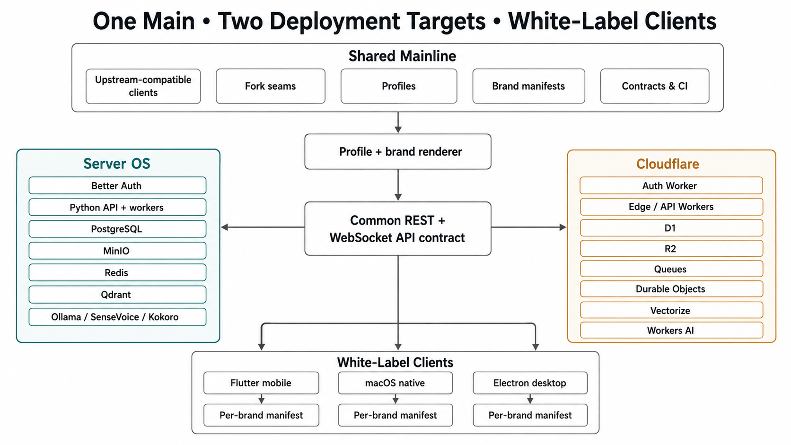
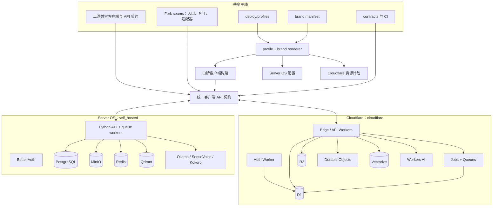
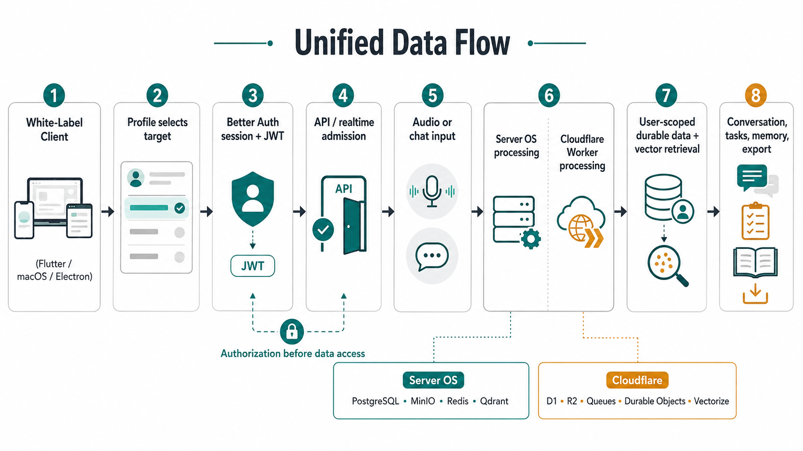
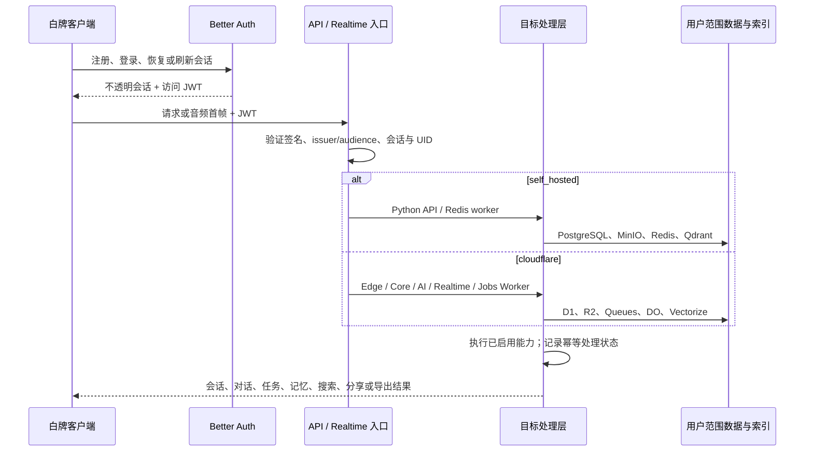
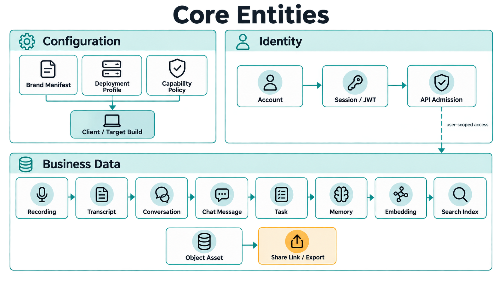
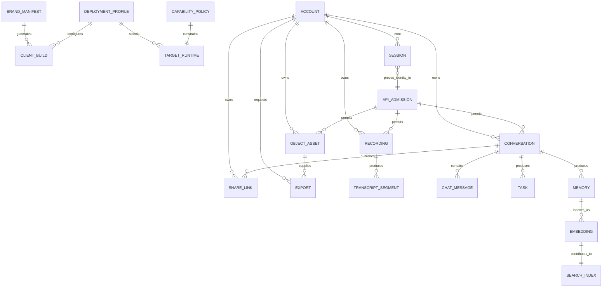
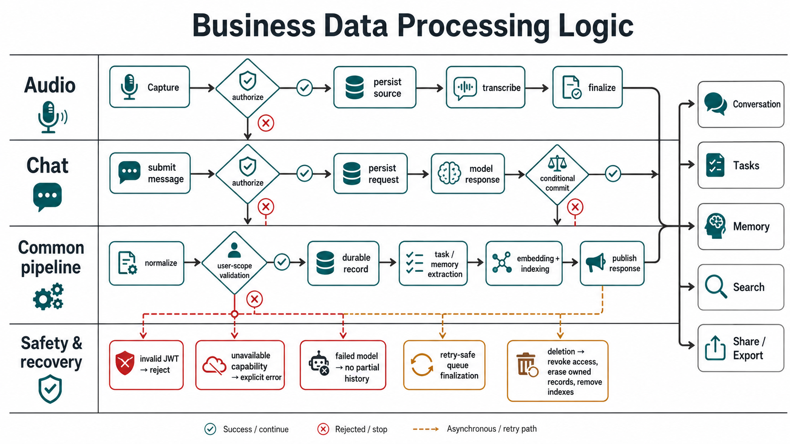
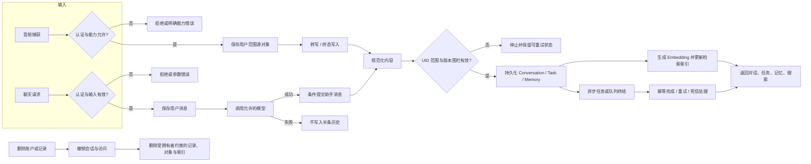

# 整体架构：一条主线、两个部署目标、白牌终端

本文说明当前候选版本的目标架构、数据边界和核心处理路径。它以
[`implementation-status.md`](../implementation-status.md) 记录的本地候选为
依据：代码共用一条主线，部署由 profile 选择，品牌由 manifest 注入。
架构图中的名称用于沟通；下面的 Mermaid 图和文字描述是可维护的准确
版本。本文不代表远程部署、签名制品或生产发布已经完成。

**Cloudflare 验证状态（2026-09-05）：** 冻结候选 `095a38c9…cab89`
完成 35 项真实本地运行时检查，覆盖注册、会话、录音、转写、队列生成
记忆/任务、聊天、分享、导出及账户删除；ASR/模型推理 IO 受控。
21:43（北京时间）Cloudflare API 再次读取显示，8 个 Eddy 生产 Worker 尚不存在，
Auth/App 两份 D1 只有系统表。资源创建、构建 dry-run、本地验收均不能代替
生产验收。完整业务、双目标一致性及 macOS 到生产的闭环仍待验证。
每日使用量的后续源码检查已通过，尚未进入上述冻结候选；详见
[每日使用量证据](../implementation-2026-09-05/eddy-desktop-daily-usage.md)。
后续源码已完成 [每日回顾生成](../implementation-2026-09-05/eddy-daily-recap.md)
及品牌导出文件名的本地运行验证；这些变更尚未进入旧冻结候选或生产环境。
当前源码重新校验旧候选时明确拒绝版本不一致；生产状态与历史 Omi 部署的
区别见 [Eddy 验收核对](../implementation-2026-09-05/eddy-cloudflare-release-verification.md)。

## 1. 架构目标与约束

| 目标 | 架构选择 |
| --- | --- |
| 一个长期代码基线 | 基于 `upstream/main` 的单一 fork 主线；上游文件默认不改，差异收敛在 fork-owned 目录、生成阶段和少量受守卫的钩子中。 |
| 两个部署目标 | `self_hosted` 是参考实现；`cloudflare` 单向对齐同一客户端 API 契约。 |
| 多品牌终端 | `brand/<id>/manifest.yaml` 提供名称、域名、包标识、资源和设备身份；构建阶段产生各平台的私有输出。 |
| 同一客户端行为 | Flutter、macOS 与 Electron 读取同一 profile 形状，以目标配置切换身份源、端点和能力，而非维护目标分支。 |
| 租户隔离 | 每个受保护请求先完成会话/JWT 校验与 UID 绑定；记录、对象、索引、分享和导出均以 UID 为边界。 |
| 失败可解释 | 未启用能力显式失败；鉴权失败不读取数据；模型失败不提交半条聊天历史；队列处理幂等、可重试。 |

## 2. 配置和部署边界

`deploy/profiles/` 是运行时拓扑的单一事实源：它选择身份、能力和数据
服务；`brand` manifest 描述产品身份。渲染器将两者投影到 Flutter、macOS、
Electron、Server OS Compose/镜像和 Cloudflare Worker 资源计划。

| 边界 | `self_hosted` | `cloudflare` |
| --- | --- | --- |
| 身份 | Better Auth + 自托管 Auth 服务 | Better Auth + Auth Worker |
| API / 计算 | Python API 与受监督的 worker | Edge、API Core、API AI、Realtime、Jobs Worker |
| 事务数据 | PostgreSQL | D1 |
| 对象 | MinIO | R2 |
| 异步与协调 | Redis / worker | Queues / Durable Objects / Jobs |
| 向量检索 | Qdrant，BGE-M3 1024 维 | Vectorize，最多 1536 维 |
| 默认模型能力 | 本地 Ollama、SenseVoice、Kokoro | Workers AI 与 profile 明示的托管能力 |

客户端只依赖 API 契约、profile 中生成的 origin 和能力，而不感知目标内部
的 Postgres、D1、MinIO 或 R2 实现。Cloudflare 内部的服务绑定和断言头同样
不会成为客户端契约。

## 3. 统一数据流

数据流中有四个硬边界：

1. **先授权再读写。** API admission 将请求绑定到唯一 UID；跨用户读取和
   写入在数据处理前拒绝。
2. **原始数据与派生数据分开。** 音频、附件等对象存于对象服务；业务记录
   保留引用、状态、权限和审计所需元数据；向量/搜索索引为可重建派生物。
3. **能力由 profile 决定。** 配置缺失或禁用时返回显式不可用，不隐式转去
   上游或其他云供应商。
4. **异步边界保留终态。** 后台任务以内容身份/终态围栏处理，重试不产生
   重复业务副作用。

## 4. 核心概念、业务实体与数据所有权

| 层 | 概念 / 实体 | 所有者与职责 |
| --- | --- | --- |
| 配置 | Brand Manifest | 品牌名、域名、包 ID、资源、设备身份和发行命名；只在构建与资源规划时注入。 |
| 配置 | Deployment Profile / Capability Policy | 选择目标、服务拓扑、端点、模型和能力开关；是运行时行为的权威。 |
| 身份 | Account、Session、JWT | Account 是所有用户数据的主所有者；会话撤销、删除和 token 验证在入口完成。 |
| 采集 | Recording、Transcript Segment、Chat Message | 原始输入与转写/文本输入。Recording 产生转写片段；Chat Message 归入会话。 |
| 产品 | Conversation、Task、Memory | 面向用户的业务结果。Conversation 提供上下文；Task 和 Memory 可由对话/录音处理生成。 |
| 派生数据 | Embedding、Search Index | 从获准的内容派生，用于检索；删除与重建均需跟随原始记录的 UID 边界。 |
| 交付 | Object Asset、Share Link、Export | Object Asset 保存大对象；分享只公开经过裁剪的预览；导出只能读取调用者有权读取的记录。 |

配置实体不属于某个用户账户；它们在部署或构建时决定产品形态。用户数据
实体均需要 API admission 的 UID 范围验证，且删除链路必须移除其对象和索引。

## 5. 业务数据处理逻辑

处理逻辑的关键规则如下：

- **聊天原子性：** 只有模型成功且会话仍归当前 UID 时，助手消息与相关使用
  记录才一起提交；失败不留下部分回复。
- **录音终态：** 一个录音只能结算一次。重连、队列重投和延迟完成通过终态
  围栏消除重复的转写、费用或任务副作用。
- **记忆和检索：** Memory 先作为用户范围业务记录保存，再异步生成 embedding；
  搜索返回前再次按 UID 过滤。
- **分享与导出：** 分享链接不是原记录的宽泛授权，输出字段按公开策略裁剪；
  导出从已授权的记录集合生成。
- **删除：** 先阻断会话/访问，再按拥有者删除业务记录、对象和索引。缺少某个
  下游服务时，流程保留可恢复的清理状态，而不是假定删除已完成。

## 6. 可验证性与发布边界

本地候选已对两个 target 使用同一组身份、onboarding 和 Tasks 合同进行产品
验证；Cloudflare 另有录音、聊天和分享合同。白牌构建已覆盖 Flutter、macOS
和 Electron 的两目标阶段。

这与发布资格不同。仍需在对应真实环境补齐的证据包括：远程 Server OS 安装和
恢复、Cloudflare 资源 apply 与观察、签名/公证/安装包、真实品牌视觉验收、
设备与 OTA，以及完整的跨目标端到端产品循环。精确当前状态见
[`../implementation-status.md`](../implementation-status.md) 和
[`../implementation-2026-09-05/closure-audit-0d4f71b4ab.md`](../implementation-2026-09-05/closure-audit-0d4f71b4ab.md)。
