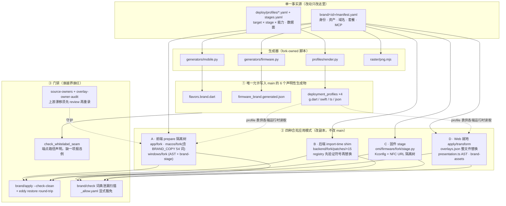
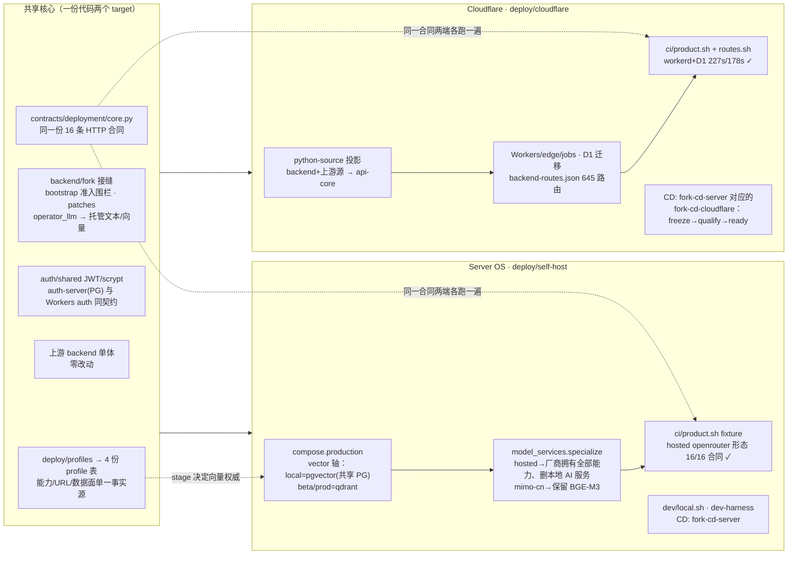

# 白牌化与双部署目标：架构图与验证状态

> 日期：2026-09-28 · 状态：以当前 `main` 实测为准（基线 `eca96aa579`，领先 origin 的提交待推送）
> 图用于沟通，**代码与检查才是权威**：[`WHITELABEL-MODEL.md`](../WHITELABEL-MODEL.md) 是白牌宪法，
> [`three-track-architecture.md`](three-track-architecture.md) 描述整体数据边界与处理路径，
> [`../README.md`](../README.md) 是计划索引，[`../../AGENTS.fork.md`](../../AGENTS.fork.md) 是纪律入口。
> 本文不声称远程部署、签名制品或生产发布已完成；每条"✓"都标注了本次实测的命令与结果。

## 1. 白牌数据流：单一输入 → 四种合宪模式 → 6 个 main 接缝

### 图解

- **品牌唯一输入**是 `brand/<id>/manifest.yaml`；生成器是唯一消费者。四个非生成类别
  （desktop/windows/backend/web/docs/ci）由 `apply.py` 的 `SKIP_REASONS` 显式标注归属
  （模式 A/B/D/META），不是空壳。
- **6 个接缝**是写入 `main` 的全部合法产物（`WHITELABEL-MODEL` §2）；其余一切改副本：
  前端在隔离 stage 树、后端在 import-time patch、固件在复制树、Web 在 staging 树。
- **重叠词的替换语义**（macOS `replace_brand_literals`）：先验证每条审阅计数
  （fail-closed），再单遍最长优先替换，`display == "Omi"` 时零写入（回归品牌字节恒等）。
- **排除项必须带理由**（`_allow.yaml`、`BRAND_COPY` 内联注释）：豁免只有"词典明确不认识"
  一种形式，不允许代码级 skip。

## 2. 双部署目标：共享核心 → 两条发射线

### 图解

- **共享而非拷贝**（实测核对过）：HTTP 合同是单文件，两 target 的 fixture 各自 resolve 同一
  路径；`auth/shared` 的 JWT 策略与 scrypt 为两端共用；profile 表由同一 `render.py` 产出四份。
  镜像而非重复的部分是刻意的：CF-only 的 staging 门、D1 与 PG 两套迁移（存储引擎不同）、
  Vectorize 1536 上限与 bge-m3 1024 维度（不同概念）。
- **托管形态语义**：`operator_ai` 选择（openrouter / siliconflow / cloudflare-gateway / mimo-cn）
  由 profile 行携带，`select()` 拒绝同时存在本地模型行；hosted 拥有 LLM/ASR/TTS/向量全部能力
  （`specialize` 删本地 AI 服务），mimo-cn 拥有文本/音频、保留本地 BGE-M3。
- **准入围栏**：`fork.bootstrap` 对 `row.llm` 一律 `ProfileError`；向量权威与 stage 绑定
  （local=pgvector、其余=qdrant）不一致即拒绝启动——fixture 的 `VECTOR_STORE_PROVIDER`
  冲突正是被它拦下的。

## 3. 目标 → 实测证据（2026-09-27/28）

| 目标 | 证据（命令 → 结果） |
|---|---|
| 白牌可配置 | `brand/apply.py --brand omi-upstream --check-clean` exit 0；`fork/preflight` 的 eddy round-trip 只碰 2 个声明生成物；`check_whitelabel_seam --base origin/main` 全绿（9 项 seam 声明）；`profiles/check_tables.py` 四表 current |
| 出货文本（eddy stage 扫描） | macOS 87→30、可见 Omi 58→1（唯一剩余是刻意排除的数据路径）；Web 交付 UI 文案 0 泄漏（生成侧已品牌化）；Windows 残留=稳定工具键/测试；Flutter 剩 ARB 10,396（已知 B3 缺口，参数化未做） |
| Server OS target | `deploy/self-host/ci/product.sh`（hosted openrouter、无 embedding store）exit 0，`core-results.json` 16/16 pass |
| Cloudflare target | CI `fork-cloudflare-product-core` PASS 226.9s、`fork-cloudflare-routes` PASS 178.0s（api-core 1299、vitest 1157 全过） |
| 门禁 | 上游 manifest 本地矩阵 228 绿 / 7 条继承红（全部登记于 [`../ci-coverage.md`](../ci-coverage.md) §6，含自愈条件）；fork manifest 39 项；`check-upstream-touch --aggregate` 4 条白名单全在预算 |

### 已知缺口（不做粉饰）

1. **ARB 参数化未做**：非 omi 品牌的 190 键 l10n 仍含 'Omi'（上游队列 #5 提案、按政策不向上游提交，
   需 fork 侧 mode-A stage 方案）。
2. **`check.py --release` 是不可达脚手架**：`release_ready` 因 firmware 恒 partial 而永假，
   两品牌实测均 exit 1；出货文本验收目前用 staged 源扫描替代。
3. **真实 omi-upstream macOS stage 跑不了**：`brand/omi-upstream/` 无 assets 目录且 manifest 声明
   svg 而 macOS 管线要 png——今日只有 synthetic fixture stage 被 CI 演练。
4. **CI hosted fixture 需 secrets**：repo 无 operator secrets 时 `FORK_SKIP_CHECKS` 跳过
   `fork-selfhost-product-core`（本地已用真实 key 实证）。
