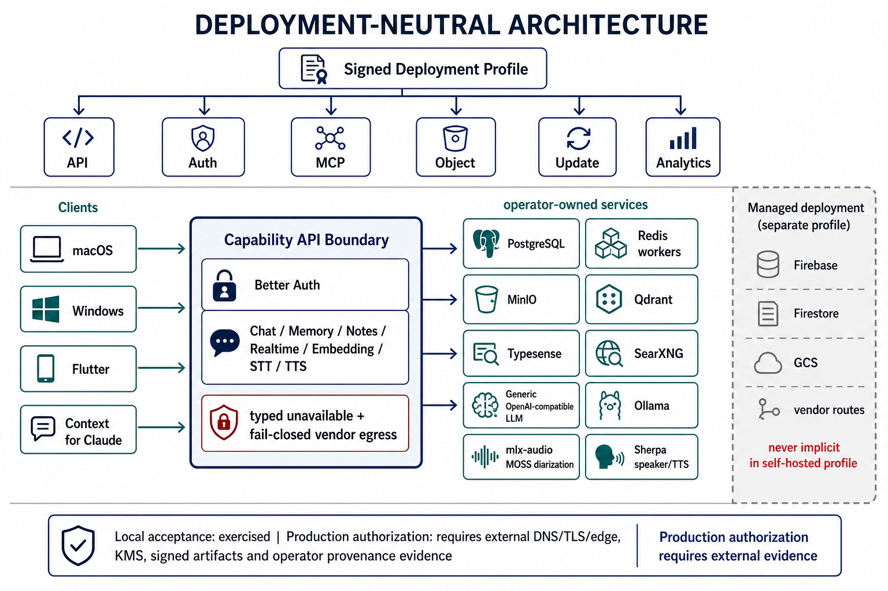
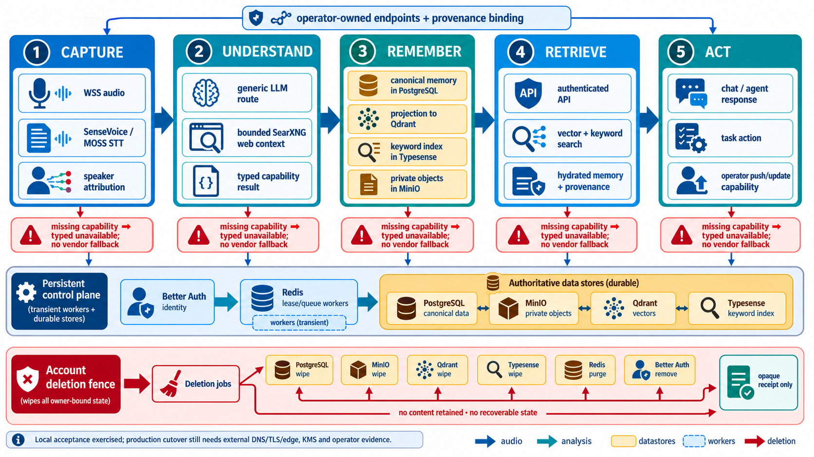

# Deployment-neutral architecture diagrams

These diagrams describe the current self-hosted, operator-owned route and data
boundaries. They distinguish local acceptance evidence from the external
operator evidence still required before production cutover.

