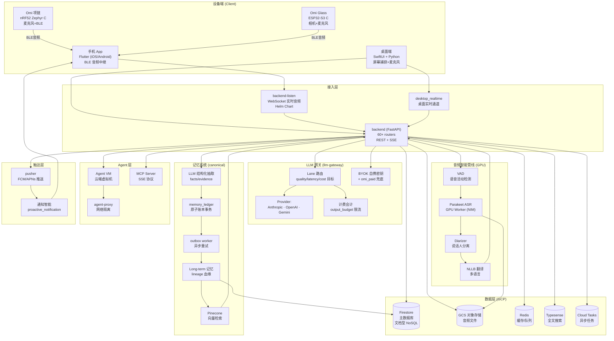
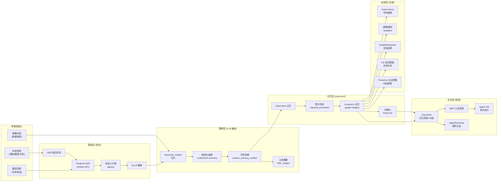
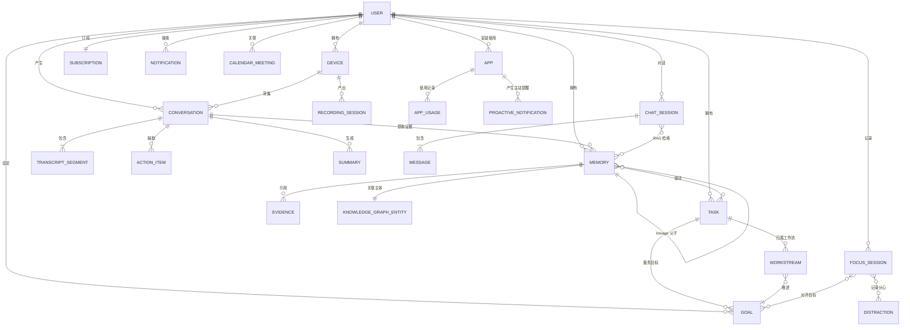

# Omi (BasedHardware) 系统架构分析

> 基于 2026-08-07 shallow clone (`git clone --depth 1 https://github.com/BasedHardware/omi.git`) 代码分析。
> 代码规模:63.5 万行(Flutter 67.8w / Swift 30.7w / Backend 54w / 固件 C 12.2w)

---

## 一、云端一体架构(端到端)



### 部署形态(GCP 原生,Kubernetes)
- `infrastructure/opentofu/`:foundation 基建 + environments 环境 + pilots
- `backend/charts/`(Helm):`backend-listen`、`llm-gateway`、`agent-proxy`、`agent-vm-firewall/reaper`、`vad`、`diarizer`、`parakeet`(GPU)、`nllb-translation`、`pusher`、`deepgram-self-hosted`、`monitoring`
- `backend/modal/`:Modal serverless 跑定时任务(memory_maintenance、notifications、vad、speech_profile)
- `backend/jobs/`:agent_vm_reconciler、short_term_lifecycle_worker(云调度)

### 同步一致性设计
- 设备→云端:**WAL(Write-Ahead Log)** 双端同步,`sync_ledger` 保证幂等
- 记忆写入:memory_ledger 原子事务 + outbox 异步重试 + 向量 repair worker 自愈

---

## 二、AI 架构



### LLM 网关设计(核心创新)
- **Lane 路由**:每个业务面(surface)一个 lane,声明质量/延迟/成本权重目标,由 resolver 动态选路(如 `chat-structured` 质量 0.6 / 延迟 0.2 / 成本 0.2)
- **Credential Policy**:`omi_paid`(公司付费)vs BYOK(用户自带密钥);BYOK 失败分类(`byok_auth`/`byok_quota`/`byok_rate_limit`…)决定可否降级到公司付费
- **路由版本化**:`active_route` / `last_known_good` 双指针,新路由灰度后可回滚
- **记账**:accounting 按 token 计量 + output_budget 防滥用 + cost_rate_cards 成本卡
- 提供商:Anthropic / OpenAI(兼容面)/ Gemini,统一 OpenAI-compatible surface

### 记忆抽取数据结构(事实三元组)
```
Memory = proposition(主语, 谓语, 宾语)
       + category + tags + headline
       + Evidence[] { source_id(对话), extractor_id, capture_confidence, independence_group }
       + subject_entity_id → KG 实体
       + veracity(置信度) + durability(持久期)
```

---

## 三、业务对象与关系



### 核心对象字段与生命周期

| 对象 | 关键字段 | 生命周期 |
|---|---|---|
| **User** | uid, plan(Free/Plus/Architect), subscription, 位置同意书 | 订阅驱动配额 |
| **Device** | 设备类型(项链/眼镜/手机/桌面), BLE 状态 | 配对→采集→同步 |
| **Conversation** | segments[], source(设备/桌面/电话/导入), status(post-processing 状态机) | 采集→转录→后处理→终态 |
| **Memory** | proposition, category, tags, evidence[], veracity, durability | short-term → **唯一晋升通道** → long-term;每级:archived/reviewed/rejected |
| **Task / ActionItem** | title, status, evidence_ref, provider(Asana/Linear…), priority | 对话抽取 → 用户确认 → 外部执行 → 完成 |
| **Goal** | type, status, metrics, relationship, source(work-intent) | 创建→对齐→进度事件→达成 |
| **Workstream** | status, sensitivity, events[], artifacts[] | 工作意图编排(2026 新增层) |
| **FocusSession** | distractions[], goals[], stats | 专注周期(对抗分心) |
| **App (Plugin)** | catalog, oauth, usage_history, personas | 应用商店分发 + 用量计量 |
| **KG Entity** | 实体类型(人/公司/概念), 关系边 | 图增强,随记忆晋升 |
| **ChatSession** | messages[], 记忆上下文窗口 | 检索增强对话,配额计费 |

### 关键关系语义
1. **证据链**:Memory → Evidence → Conversation(每段记忆可溯源到原始对话片段,支持红action)
2. **记忆晋升闭环**:short-term 只能通过 promotion 进入 long-term,且要求 ledger 事务原子记录晋升回执 + 图断言
3. **任务-目标-工作流**:Task 附 evidence 关联 conversation,归入 Workstream 或服务 Goal(双层归属)
4. **RAG 检索**:ChatSession 检索 Memory(向量)+ KG 遍历,默认折叠 lineage 血缘让同一逻辑记忆只出现一次

---

## 四、工程特质总结

1. **云原生重度**:Firestore + Pinecone + GCS + Cloud Tasks + Modal + Helm + Opentofu,「可自托管」是宣称,实际是 GCP 绑定
2. **双轨兼容**:legacy 记忆系统 ↔ canonical 系统并存,契约层隔离 + 灰度 rollout
3. **AI 可观测**:LLM gateway 有完整计费/降级/回滚/影子(shadow)机制
4. **治理即代码**:invariant 注册表(INV-*)+ 守卫测试 + 契约测试 + pylock 依赖锁
5. **业务演进方向**:2026 重心 = Agent(VM/MCP)→ 主动式 AI(proactive)→ 工作流(Workstream/Goal)→ 桌面屏幕理解
